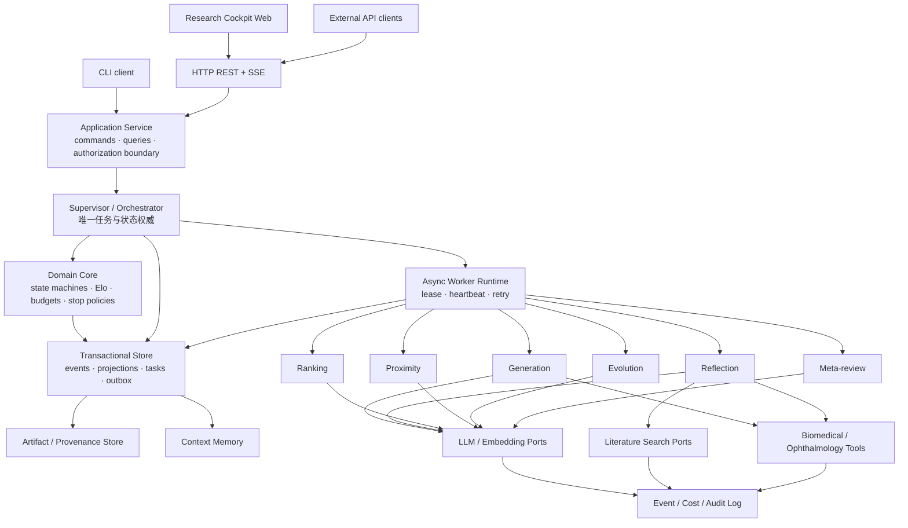
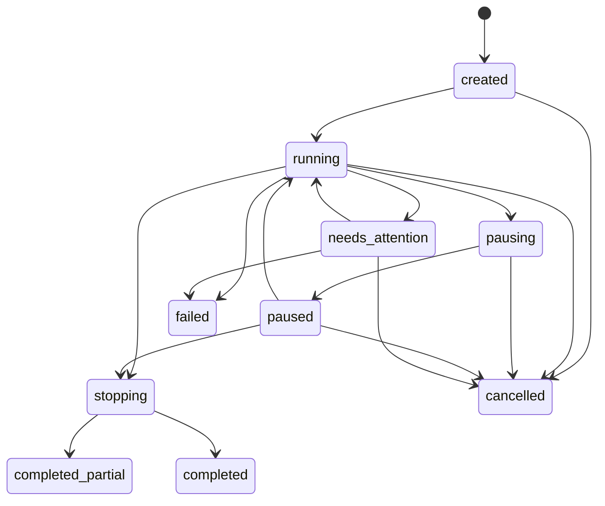
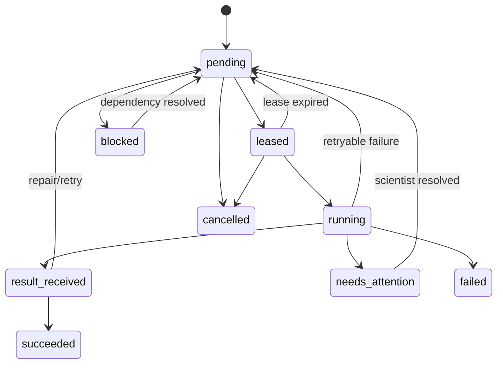
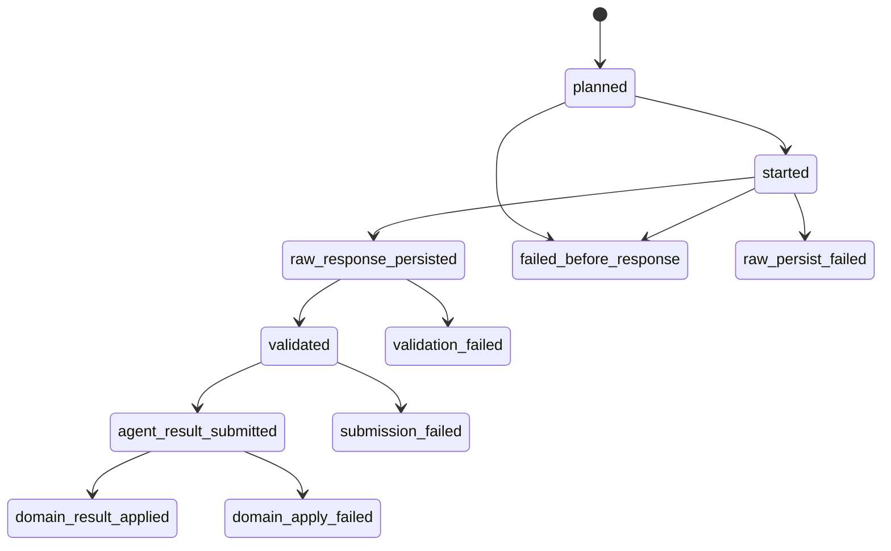
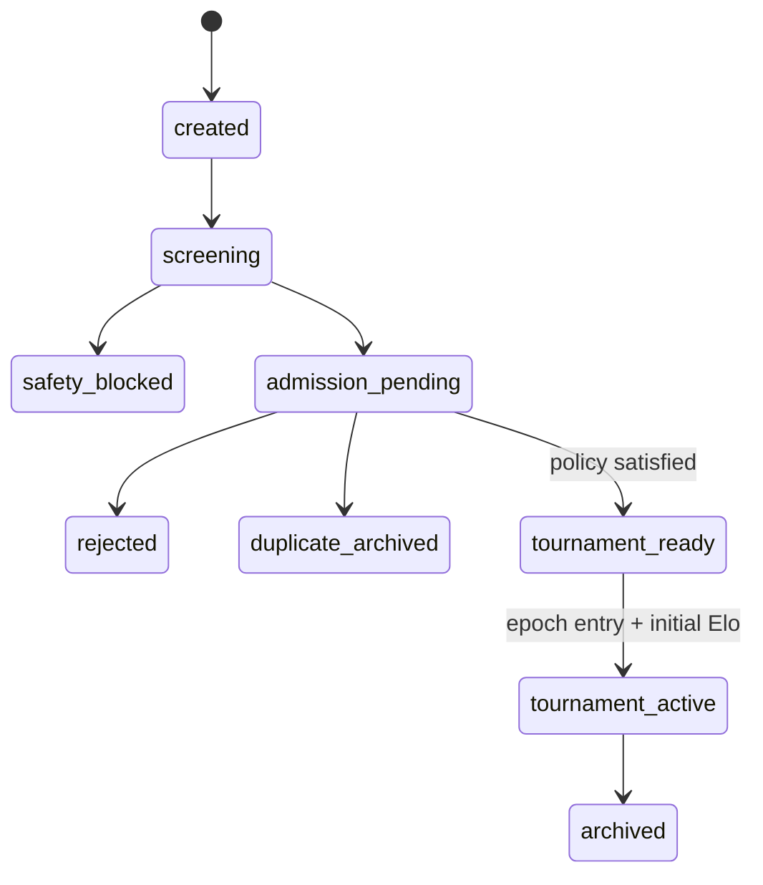

# Co-Scientist 论文忠实复刻：分阶段预览版设计规格

- 文档状态：用户条件已逐项纳入，可进入 Core Preview 实施计划
- 日期：2026-07-30
- 目标版本：Core Preview → Research Preview → Product Preview
- 首要领域：生物医学、眼科、基础研究、药物研发
- 首个端到端验收题：微创晶状体手术后透明再生与纤维化再生的机制决定因素

## 1. 目的与设计原则

本项目要构建一个可自行部署、可审计、可扩展的 Co-Scientist 开发版。系统应尽可能忠实复现论文公开描述的框架和可观察行为，而不是只生成一篇看似合理的研究报告。

核心目标是：

1. 接收研究目标、约束、背景材料和科学家反馈；
2. 生成多个机制明确、可证伪的候选假设；
3. 通过分层审查、证据检索、邻近度分析、科学辩论和 Elo tournament 比较候选；
4. 在高潜候选上执行 Evolution，但保留父假设并让子代重新完成准入流程；
5. 用 Meta-review 将跨候选的共性批评反馈给后续运行；
6. 在可配置计算预算下持续改进，并由 Supervisor 执行明确停止策略；
7. 输出 ranked hypotheses、证据链、批评、比赛记录、区分性实验、成本与复现清单；
8. 使用论文公开方法和可获得数据评价行为保真度与科学性能。

设计遵守以下原则：

- **行为忠实优先于内部猜测**：复现论文公开控制流和 prompt 契约；不假装知道未公开源码。
- **Supervisor 单一权威**：只有 Supervisor 可以创建任务、提交状态迁移、触发后继任务、分配预算和终止运行。
- **Agent 是受约束的 worker**：Agent 只接收结构化输入并返回结构化结果或建议，不自行递归调度。
- **不可变历史**：假设内容、审查、比赛和外部调用保留版本与来源；改进生成新实体，不覆写历史。
- **证据与观点分离**：原始来源、提取证据、模型判断、专家判断和系统派生结论分别存储。
- **成本可配置但始终记账**：费用上限可显式设为 unlimited，实际 token、调用、工具费用和墙钟时间始终记录。
- **单机可用，边界可替换**：Core Preview 默认单机进程和 SQLite，但不把业务逻辑绑定到存储、模型或搜索供应商。
- **失败可恢复**：内部逻辑提交通过事务和幂等键实现 exactly-once effect；外部调用按可审计的 at-least-once 处理，不作不真实保证。
- **性能声明分级**：区分框架行为复现、方法复现、公共数据复现和湿实验验证。

## 2. 证据等级与声明边界

每个论文相关配置、prompt 和行为在 evidence pack 中标记来源等级：

| 等级 | 含义 | 示例 |
|---|---|---|
| `paper_explicit` | 论文正文或 Methods 明确给出 | 六类 Agent、异步循环、初始 Elo 1200 |
| `supplement_explicit` | Supplementary Notes/figures/tables 明确给出 | Agent 伪代码、prompt 输入槽位、部分消融方法 |
| `replica_default` | 公开材料留白，本项目为可运行性选择的默认值 | Elo K-factor、lease 时长、plateau 窗口 |
| `developer_extension` | 为可用性、可观测性或多供应商支持加入 | REST/SSE API、五家模型适配器、研究驾驶舱 |

所有 `replica_default` 必须：

- 在配置 schema 中可修改；
- 在 run manifest 中保存解析后的实际值；
- 不在报告中描述为论文原始参数；
- 在 benchmark 比较中保持固定或作为独立变量。

本项目可以声称：

- 框架和可观察控制流与公开论文描述对齐；
- 公开方法在指定模型、数据、工具和计算预算下被重新执行；
- 某一版本在公开 benchmark 或领域盲评上达到记录的结果。

本项目不能仅凭软件运行声称：

- 与 Google 内部实现逐行等价；
- 复现不可获得的内部检索、私有 benchmark 或原始计算规模；
- 已复现论文湿实验结论；
- 内部 Elo 上升等同于外部科学质量提高。

## 3. 范围

### 3.1 Core Preview

Core Preview 是第一个发布门槛，只包含足以验证论文核心循环和工程不变量的纵向切片：

- ResearchGoal/ResearchPlan 的最小解析、固定版本和配置加载；
- 确定性领域内核：事件、投影、Run/Task/Hypothesis 状态机、TournamentEpoch、Elo、预算和停止策略；
- Supervisor 单一调度权威、持久任务、ExternalCall 生命周期、checkpoint 和 replay；
- Generation、Reflection、Ranking、Proximity、Evolution、Meta-review 的最小可运行 skill 契约；
- policy-driven Reflection：initial review 必需，其他 review 由 profile/trigger 决定；
- HypothesisContent、HypothesisProjection、NoveltyAssessment、Review、Match 和 provenance；
- fake/replay provider；
- **一个**真实 LLM provider adapter；
- **一个**文献 provider adapter；
- SQLite、artifact store、Application Service 边界和 CLI；
- deterministic unit/contract/scenario tests；
- 晶状体研究目标的 smoke test；
- run manifest、事件、证据、排名、成本和 partial/final CLI 导出。

Core Preview 不以 React Web、HTTP/SSE、五家 LLM provider、完整生物医学数据库、GPQA 或全量论文消融为发布门槛，也不创建这些模块的全量脚手架。

### 3.2 Research Preview

Research Preview 在 Core Preview 之上增加：

- paper-faithful、deep-review 和 cost/quality experimental profiles；
- OpenAI、DeepSeek、Qwen、Gemini、Claude 的统一 adapter 与跨模型评测；
- 多文献来源、全文/引用解析、首批生物医学/眼科工具；
- 高级 Reflection strategies、证据冲突处理和专家反馈；
- 完整位置偏差、Evolution、Meta-review、Proximity 和 test-time scaling 消融；
- GPQA、公开 paper-QA 替代集和晶状体盲评；
- 稳定 HTTP API 与面向研究运行的导出/审计。

### 3.3 Product Preview

Product Preview 在 Research Preview 之上增加：

- React Research Cockpit；
- SSE 实时事件、tournament/proximity/lineage 可视化；
- provider/tool 配置体验、运行恢复、错误处理和成本控制界面；
- 人工 hypothesis/review/feedback 的完整交互；
- 面向技术型研究者的部署文档和运维检查。

### 3.4 所有预览版均明确不包含

- 正式 SaaS 托管；
- 多租户账号、组织 RBAC、计费和配额销售；
- 分布式工作流平台或 Kubernetes 运维；
- 任意代码、shell 或湿实验设备的自治执行；
- 自动访问付费墙内容或绕过来源许可；
- 对论文私有 adversarial safety 数据、paper-QA 或完整专家集的虚构复现；
- 自动替代领域专家作出临床、实验伦理或资源投入决策。

### 3.5 交付分解

整个目标拆为六个相互连接但可独立验收的子项目：

1. **论文证据包**：公开伪代码、prompt 契约、行为映射和复现声明。
2. **核心内核**：领域对象、Supervisor、任务、事件、状态机、Elo 和停止策略。
3. **工具与证据层**：模型、搜索、文献、数据库、embedding 和 provenance 适配器。
4. **专家与安全层**：输入审查、中间安全、工具边界、反馈和审计。
5. **评测与复现**：离线场景、消融、GPQA、公开替代集、scaling 和领域验收。
6. **产品与运维**：应用 API、CLI、Web cockpit、配置、运行恢复和导出。

这些子项目共享本规格中的领域模型和稳定接口，不各自定义一套不兼容 schema。

## 4. 总体架构



### 4.1 边界规则

- CLI 和 Web 不访问数据库，只调用 Application Service。
- Application Service 将用户意图转换为 command；它不直接修改领域状态。
- Supervisor 验证 command、AgentResult 和 tool result，并在事务中提交合法迁移。
- Worker Runtime 负责领取和执行已存在任务，不推断业务后继任务。
- Agent 不持有数据库连接，不直接写事件、不更新 Elo、不修改预算。
- Core 是不依赖具体 LLM、搜索、Web 框架和数据库的确定性代码。
- Adapter 将供应商响应转换为内部 schema；供应商专属字段保留在 audit metadata。
- Store、Artifact、Context Memory 和日志都按 `run_id` 隔离。

### 4.2 技术栈选择

Core Preview 采用：

- Python 3.11+；
- Pydantic v2 作为领域/API schema；
- SQLAlchemy 2 + Alembic；
- SQLite WAL 作为 Core Preview 数据库；
- `asyncio`/AnyIO 实现单机异步 worker；
- Typer 提供 CLI；
- pytest 提供单元、契约与集成测试。

Research Preview 增加 FastAPI REST；Product Preview 增加 SSE、React 和 TypeScript。以上都是 `developer_extension`，不是论文原始实现声明。PostgreSQL adapter 不属于 Core Preview 发布门槛；但持久化端口和 migration 不得依赖 SQLite 专属业务语义，以便后续替换。

## 5. 目标项目目录

以下是目标结构，不在设计阶段创建实现文件：

```text
co-scientist/
├── evidence/
│   ├── source_manifest.yaml
│   ├── behavior_map.yaml
│   ├── prompts/
│   └── pseudocode/
├── skills/
│   ├── research_plan/
│   ├── generation/
│   ├── reflection/
│   ├── ranking/
│   ├── proximity/
│   ├── evolution/
│   └── meta_review/
├── src/co_scientist/
│   ├── domain/
│   │   ├── models/
│   │   ├── events/
│   │   ├── state_machines/
│   │   ├── policies/
│   │   └── services/
│   ├── application/
│   │   ├── commands/
│   │   ├── queries/
│   │   └── dto/
│   ├── supervisor/
│   ├── runtime/
│   ├── agents/
│   ├── ports/
│   ├── adapters/
│   │   ├── llm/
│   │   ├── embeddings/
│   │   ├── literature/
│   │   ├── biomedical/
│   │   ├── persistence/
│   │   └── artifacts/
│   ├── api/
│   └── cli/
├── web/
├── configs/
│   ├── profiles/
│   ├── policies/
│   └── domains/
├── benchmarks/
│   ├── manifests/
│   ├── datasets/
│   ├── evaluators/
│   └── reports/
├── tests/
│   ├── unit/
│   ├── contract/
│   ├── scenario/
│   ├── integration/
│   └── scientific/
└── artifacts/
    └── runs/<run_id>/
```

`skills/` 是本系统的版本化 Agent 协议目录，不等同于 Codex 用户技能目录。每个 skill 目录包含：

- `manifest.yaml`：skill ID、版本、Agent 类型、允许工具、输入/输出 schema、默认 prompt；
- `SKILL.md`：面向研究者的行为、限制和论文对应说明；
- `prompts/`：system、task、debate 和 repair 模板；
- `schemas/`：版本化结构输出 schema；
- `fixtures/`：最小正例、反例和 replay fixture；
- `evaluators/`：该 skill 的契约检查，不包含通用 benchmark。

运行时只加载 allowlist 中、版本已固定的 skill。一次 run 的 manifest 保存每个 skill 的版本和内容摘要。

## 6. Supervisor / Orchestrator

### 6.1 职责

Supervisor 是确定性的应用级编排器，负责：

1. 接收并验证 ResearchGoal；
2. 调用 ResearchPlan skill，验证输出并提交计划版本；
3. 根据计划创建初始 Generation 任务；
4. 计算当前状态可执行的后继任务；
5. 给任务分配优先级、模型 profile、工具权限和预算；
6. 校验 AgentResult schema、安全结果和领域不变量；
7. 提交 Hypothesis、Review、Match、Proximity、Feedback 等领域事件；
8. 执行 Hypothesis、Task 和 Run 状态迁移；
9. 确定性更新 Elo、成本、统计和投影；
10. 触发 Evolution、Meta-review、overview 和 finalization；
11. 执行 hard budget、anchor/top-k/cluster/budget convergence 和 scientist stop；Elo plateau 只作为辅助信号；
12. 生成最终输出与 completeness 状态。

### 6.2 权限不变量

- 普通 Agent 不能创建任务。
- 普通 Agent 不能调用另一个 Agent。
- 普通 Agent 不能改变 Hypothesis、Task 或 Run 状态。
- 普通 Agent 不能直接写 SharedMemory、event log 或 projection。
- Agent 可以返回 `recommended_actions`，但 Supervisor 可以接受、拒绝或延后。
- 所有后继任务由 Supervisor 基于当前已提交状态生成。
- 同一业务意图只能通过稳定 idempotency key 创建一份逻辑任务。

### 6.3 调度循环

每次 Supervisor tick 执行：

1. 读取 run 的最新一致投影；
2. 回收过期 task lease；
3. 接收已完成 worker result；
4. 校验 result 与 task、skill、schema 和 prompt version；
5. 在单一事务内写入事件、更新投影、写成本增量并创建合法后继任务；
6. 计算预算和停止信号；
7. 若进入 stopping，则禁止产生探索任务并执行 finalization；
8. 否则计算 runnable intents；
9. 根据优先级、依赖、并发配额和模型能力分配任务；
10. 写 checkpoint 统计与 scheduler decision event。

建议优先级从高到低为：

1. 安全与不变量检查；
2. 已领取任务的结果提交与恢复；
3. 新 hypothesis 的准入审查；
4. tournament 中欠比赛候选；
5. 周期性 proximity 更新；
6. plateau 触发的 Evolution；
7. 周期性 Meta-review；
8. 新的 Generation 探索；
9. overview 与非终态导出。

优先级和公平性窗口均为配置项。为避免高排名候选长期占满资源，scheduler 对新候选、低比赛数候选和长期等待任务应用 aging。

## 7. Agent 与 Skill 定义

### 7.1 ResearchPlan skill

ResearchPlan 不是第七个自治 Agent，而是 Supervisor 调用的受约束解析 skill。

输入：

- research title、goal、constraints；
- 背景文档和研究者提供的假设；
- 输出偏好、领域、风险等级；
- 可选的先前计划版本和修改指令。

输出：

- 结构化目标；
- 必须覆盖的因果变量与时间顺序；
- 假设评价维度及权重；
- 禁止或超范围方向；
- 推荐 generation/evolution 策略；
- 证据需求和领域工具；
- 预算、停止和人工检查点覆盖值。

Supervisor 对输出执行 schema、范围、安全和预算校验后才创建 `ResearchPlanAccepted` 事件。

### 7.2 Generation Agent

职责：

- 按计划和策略产生相互区分的初始候选；
- 可先检索后生成，也可执行模拟科学辩论或条件分解；
- 将 Meta-review feedback 作为建议，不机械复制。

输入：

- ResearchPlan version；
- generation strategy；
- 已占据的 hypothesis clusters 和重复摘要；
- system-wide feedback；
- 允许的 evidence/tool context；
- model/skill version 和本任务预算。

输出：

- 一个或多个 HypothesisDraft；
- 使用的策略和生成理由；
- 需要验证的核心 assumptions；
- evidence query suggestions；
- 与已有候选可能重复的自评；
- `recommended_actions`。

Generation 结果必须先成为 `created` hypothesis，不能直接入 tournament。

### 7.3 Reflection Agent

Reflection 以策略驱动的阶段化任务运行。`ReviewPolicy` 为每个 profile 定义 `required_before_admission`、`optional_triggers`、最大重试和预算，Supervisor 根据策略创建任务，而不是把 review ladder 编码为固定状态链。

1. `initial_review`：所有 hypothesis 必需；无外部工具的快速正确性、质量、初步新颖性和安全检查；
2. `full_review`：使用文献搜索验证 correctness、quality 和 literature novelty；是否为准入前必需项由 profile 决定，`paper_faithful` profile 将其设为必需；
3. `deep_verification`：拆解核心 assumptions 与去语境 sub-assumptions，逐条判断；
4. `observation_review`：寻找长尾实验观察并比较解释力；
5. `simulation_review`：逐步模拟机制或实验流程，枚举失败模式；
6. `recurrent_review`：结合累积 tournament 与 Meta-review 对高潜候选再次审查。

`deep_verification`、`observation_review`、`simulation_review` 和 `recurrent_review` 默认不是每个 hypothesis 的 tournament admission 前置条件。它们可由高潜力、低置信度、证据冲突、scientist 请求、Meta-review 建议、tournament 不确定性或 profile 触发；也可在候选进入 tournament 后继续补充 review coverage。

输入包括 Hypothesis immutable snapshot、review stage、计划评价维度、先前审查、允许证据及全局反馈。

输出包括：

- 分维度 score、confidence 和理由；
- assumption verdicts；
- 支持、反驳和仅提供背景的 evidence links；
- safety verdict；
- critical flaws 和可修复问题；
- pass/reject 建议；
- 后续检索或审查建议。

最终 pass/reject 和状态迁移由 Supervisor 决定。

### 7.4 Ranking Agent

Ranking 负责比较，不负责更新 Elo。

输入：

- 两个经过审查的候选快照；
- ResearchPlan 评价维度；
- 双方证据与关键审查；
- debate tier、最大轮数；
- 随机化的展示顺序和隐藏 canonical ID。

模式：

- 普通候选使用单轮结构化比较；
- top-ranked 或难区分候选使用 3–5 轮科学辩论，最大 10 轮；
- 评测模式可自动执行 A/B 顺序反转。

输出：

- `decision_status`：decisive、inconclusive、invalid、needs_tiebreaker；
- decisive 时必须提供 `winner_slot`，其他状态下 winner 为空；
- 每个评价维度的比较理由；
- debate transcript；
- confidence；
- unresolved disagreement；
- position-reversal consistency。

Supervisor 将 slot 映射回 hypothesis ID。只有 `decisive` 且通过 schema、arena 和一致性校验的比赛才调用确定性的 Elo policy：

- `inconclusive`：双方证据不足或无法可靠区分，不更新 Elo；
- `invalid`：输出、输入版本、judge 或 prompt 不符合 arena 契约，不更新 Elo；
- `needs_tiebreaker`：创建独立 tiebreaker task，不更新 Elo；
- `paper_faithful_binary` 是独立 benchmark profile，要求 judge 强制二选一；它不作为默认研究运行策略。

### 7.5 Proximity Agent

Proximity 只计算候选之间的语义/机制邻近度，不直接修改图，也不评价某一假设相对于已发表文献是否新颖。

输入：

- 计划；
- 待比较 hypothesis pair 或增量候选；
- 可选 embedding、结构化机制和证据摘要。

输出：

- 1–5 similarity score；
- 相似来源：目标、机制、靶点、证据、实验或表型；
- duplicate likelihood；
- cluster/edge 建议及理由。

Supervisor 提交图边并更新 projection。图用于：

- 将难区分的相似候选优先配对；
- 候选之间的近重复检测和聚类；
- cluster coverage 和 diversity 统计；
- Evolution 的跨簇组合；
- Web 空间视图。

文献新颖性完全由 Reflection 的 `full_review`/novelty review 负责，并写入独立 `NoveltyAssessment`。Proximity 的 duplicate likelihood 只能说明“候选之间重复”，不能替代文献 novelty verdict。

### 7.6 Evolution Agent

Evolution 只创建子候选，不修改父候选。策略至少包括：

- combine；
- simplify；
- improve testability；
- strengthen mechanism；
- evidence repair；
- analogy transfer；
- unconventional alternative。

输入：

- 一个或多个父 hypothesis；
- 父候选的 review、debate、proximity 和证据；
- Evolution strategy；
- ResearchPlan 和 system feedback；
- 当前空间中的重复/多样性信息。

输出：

- child drafts；
- `parent_ids`；
- 继承、移除和新增的机制；
- 子代应优于父代的可检验理由；
- 新 assumptions 和实验预测。

每个 child 均从 `created` 开始，按当前 TournamentEpoch 的 admission policy 重新执行：

`safety → required reviews（initial 必需；其余由 profile 决定）→ NoveltyAssessment（若 policy 要求）→ Proximity candidate-space check → tournament-ready → epoch-specific initial Elo assigned → new tournament round`

父代保持不变。子代不能继承父代 Elo、比赛次数或 tournament 位置，也不能被默认视为更优。

### 7.7 Meta-review Agent

职责：

- 聚合跨 review 和 debate 反复出现的优点、弱点与盲区；
- 生成面向后续 Generation/Reflection/Evolution 的可操作系统反馈；
- 周期性生成 top-k overview；
- finalization 时生成研究空间总结。

Meta-review 不重新裁决单个 hypothesis，也不更新模型参数。反馈以版本化 ContextMemory entry 注入后续 prompt。

输出分为：

- `system_feedback`：跨候选共性模式和行动建议；
- `overview`：top-k、主要假设族、分歧、证据缺口和下一步；
- `coverage_gaps`：计划要求但尚未覆盖的变量、机制或实验；
- `safety_direction_check`。

### 7.8 AgentResult 通用契约

六类 Agent 都返回同一个 envelope：

- `task_id` 和 `idempotency_key`；
- `skill_id`、`skill_version` 和 `output_schema_version`；
- `input_snapshot_hash`；
- `status`：completed、partial、rejected、failed；
- 类型化 `payload`；
- `evidence_refs` 和新 artifact refs；
- `recommended_actions`；
- `warnings`、`access_issues`；
- `raw_response_artifact`；
- runtime 附加的 provider、token、cost、latency 和 retry/fallback metadata。

`recommended_actions` 只是建议，不是 Task，也不能包含可执行回调。Supervisor 根据已提交状态、预算和不变量决定是否转换为后继 task。任何 input snapshot hash 不匹配的迟到结果都不能覆盖当前 projection。

## 8. 领域数据模型

### 8.1 标识与通用字段

所有实体使用不可推断的稳定 ID，并至少包含：

- `id`；
- `run_id`；
- `schema_version`；
- `created_at`；
- `created_by`；
- `event_sequence`；
- `provenance_refs`；
- 内容摘要或 artifact hash。

时间使用 UTC 存储。显示层按用户时区转换。

### 8.2 ResearchGoal

字段：

- `title`；
- `goal_text`；
- `constraints`；
- `background_artifact_refs`；
- `submitted_hypotheses`；
- `domain`；
- `safety_classification`；
- `version`。

ResearchGoal 修改生成新版本。运行始终绑定明确版本。

### 8.3 ResearchPlan

字段：

- `goal_version`；
- `problem_frame`；
- `causal_chain_requirements`；
- `evaluation_dimensions` 与权重；
- `novelty_definition`；
- `evidence_requirements`；
- `allowed_tools`；
- `generation_strategies`；
- `review_policy`：每类 review 的 required/optional/trigger/budget；
- `model_routing_profile`；
- `budget_policy`；
- `stop_policy`；
- `human_checkpoints`；
- `safety_constraints`；
- `source_level_by_field`。

### 8.4 HypothesisContent 与 HypothesisProjection

`HypothesisContent` 是不可变的科学内容，字段包括：

- `content_id`；
- `origin_type`：generated、evolved、scientist_submitted；
- `parent_ids`；
- `supersedes_id`；
- `generation_strategy`；
- `title`；
- `claim`；
- `mechanism_chain`；
- `earliest_causal_determinants`；
- `assumptions`；
- `predictions`；
- `falsifiers`；
- `discriminating_experiments`；
- `known_alternatives`；
- `evidence_refs`；
- `content_version`；
- `content_hash`。

需要“修改”时创建新的 `HypothesisContent`，并用 `supersedes_id` 或 `parent_ids` 建立关系。科学内容对象不包含生命周期、review coverage、rating、cluster、预算或运行时状态。

`HypothesisProjection` 是由事件重建的可变视图，字段包括：

- `hypothesis_id` 与 `content_id`；
- `lifecycle_state`；
- `safety_status`；
- `review_coverage`：按 stage 保存完成状态和最新 review IDs；
- `novelty_assessment_ids`；
- `admission_policy_version` 与缺失条件；
- `tournament_entries_by_epoch`；
- `current_rating_by_epoch`；
- `matches_by_epoch`；
- `cluster_memberships` 和 proximity edge 摘要；
- `active_access_issues`；
- `created_sequence`、`last_updated_sequence`。

Projection 可以删除并从事件重放；它不是科学内容的事实来源。Rating、review coverage 和 cluster 不能回写到 `HypothesisContent`。

### 8.5 MechanismChain

为支持晶状体验收题和其他机制研究，机制链由有向步骤构成：

- `step_id`；
- `time_window`；
- `context`：物种、年龄、组织、处理；
- `upstream_condition`；
- `mediator_or_cell_state`；
- `causal_relation`；
- `downstream_state`；
- `expected_readout`；
- `intervention`；
- `evidence_refs`；
- `confidence`。

机制链可以表达分叉、必要/充分条件和反馈，但必须能导出至少一个可证伪预测。

### 8.6 Review

字段：

- `review_id`；
- `hypothesis_id`；
- `stage`；
- `reviewer_profile`；
- `prompt_version`；
- `dimension_scores`；
- `confidence`；
- `assumption_verdicts`；
- `critical_flaws`；
- `safety_verdict`；
- `evidence_links`；
- `recommendation`；
- `raw_response_artifact`；
- `position_or_order_metadata`。

Review 不覆盖旧 review。Supervisor 的准入决定引用所依据的 review IDs。

`NoveltyAssessment` 是独立数据对象，由 Reflection 的 literature novelty review 产生：

- `novelty_assessment_id`；
- `hypothesis_id` 与 `content_hash`；
- `research_plan_version`；
- `review_profile`、`review_id` 和 `assessor_profile`；
- 检索 query、cutoff date 和 literature provider；
- closest prior works；
- claim/mechanism overlap；
- 分维度 novelty scores；
- `verdict`：novel、partially_novel、not_novel、insufficient_evidence；
- confidence、理由和 evidence refs；
- raw response/search artifacts；
- access issues。

NoveltyAssessment 评价“相对于已发表或可检索证据是否新颖”。它不存储候选间 cluster，也不从 Proximity score 推导 verdict。

### 8.7 TournamentEpoch、TournamentEntry、Match 与 Rating

`TournamentEpoch`（也称 Arena）定义 Elo 的可比范围：

- `epoch_id`、`run_id`；
- `research_plan_version`；
- `evaluation_rules_hash`；
- `ranking_skill_version` 与 `ranking_prompt_hash`；
- `judge_profile_hash`；
- `rating_policy_version`；
- `admission_policy_version`；
- `anchor_set_id`；
- `parent_epoch_id` 和创建原因；
- `status`：open、finalizing、closed；
- `opened_at`、`closed_at`。

只有同时属于同一 epoch 的 TournamentEntry 才能比赛并更新相互可比的 Elo。任何输入契约与 epoch hash 不匹配的 match 都是 `invalid`。

`TournamentEntry`：

- `epoch_id`；
- `hypothesis_id`；
- `content_hash`；
- `admitted_at`；
- `initial_rating`；
- `matches_played`；
- `wins`、`losses`；
- `current_rating`；
- `rating_policy_version`。

`Match`：

- `epoch_id`；
- 两个 hypothesis ID；
- 双方 content hash；
- pairing reason 与 score components；
- debate tier；
- randomized slot mapping；
- `decision_status`；
- decisive 时的 winner；
- judge profile；
- ranking prompt/rules/rating policy hashes；
- transcript artifact；
- confidence；
- reversal match link；
- pre/post ratings；
- cost entries。

Elo 规则：

- candidate 通过当前 epoch 的 admission policy 并成为 tournament-ready 后，准入事务在该 epoch 赋予默认初始 rating 1200；
- 1200 不是审查阈值；
- 默认 K-factor 为 32，仅作为 `replica_default`；
- 预期分使用标准 Elo logistic 公式；
- 只有 `decisive` match 更新 Elo；inconclusive、invalid 和 needs_tiebreaker 均不更新；
- `paper_faithful_binary` benchmark profile 保留论文 prompt 的强制二选一行为；
- K-factor、初始值和配对权重均写入 run manifest；
- rating 由 Supervisor 的纯函数更新，Agent 不返回新 rating。

Elo 不跨 epoch 比较、排序、拼接或继承。新 epoch 中重新准入的 hypothesis 获得新的 TournamentEntry 和初始 rating；旧 epoch rating 只作为历史信息展示。

ResearchPlan 版本一旦变化，当前 epoch 必须关闭并创建新 epoch。若修改涉及研究问题、关键因果链、评价维度/权重或候选可比总体，Supervisor 默认要求 fork run；若只是同一科学问题下的评价/prompt/judge/rating policy 变更，可以在同一 run 新建 epoch。两种情况都不迁移 rating。

### 8.8 Evidence 与 Provenance

`SourceDocument` 保存：

- canonical URL/DOI/PMID/数据库 ID；
- title、authors、venue、date；
- source provider、license/access status；
- retrieval timestamp；
- content hash 和原始 artifact。

`EvidenceItem` 保存：

- source document；
- 定位信息：section/page/figure/table/record field；
- 最小必要片段或结构化事实；
- extraction method；
- evidence strength；
- species、age、tissue、intervention 等领域上下文。

`ClaimEvidenceLink` 保存：

- hypothesis/review/overview 中的 claim；
- evidence item；
- relation：supports、refutes、context_only、conflicts；
- attribution author；
- confidence 和理由。

系统不得把 search snippet 当作已阅读全文的证据。无法获取全文时必须显示 access limitation。

### 8.9 Task、ExternalCall、CostEntry 与 Event

`Task` 包含：

- `task_id`、`intent_type`、`target_id`；
- `skill_id/version`；
- `idempotency_key`；
- `state`；
- `priority`；
- `dependencies`；
- `lease_owner`、`lease_expires_at`、`heartbeat_at`；
- `attempt`、`max_attempts`；
- `model_profile`、`tool_policy`；
- `reserved_budget`；
- result artifact 和 error classification。

`ExternalCall` 包含：

- `external_call_id`、`task_id`、attempt；
- 请求指纹、provider/model/tool；
- `lifecycle_state`；
- planned/started/raw persisted/validated/submitted/applied 时间；
- provider response ID；
- raw artifact ref、content hash、mime type 和 byte length；
- validated payload artifact；
- AgentResult ID；
- applied domain event sequence；
- 重试/repair/fallback parent call；
- 缓存命中、错误分类、token、费用和时延。

成功生命周期固定为：

`planned → started → raw_response_persisted → validated → agent_result_submitted → domain_result_applied`

收到供应商响应后，runtime 必须先把未经领域解释的 raw response 以 artifact 持久化并提交 `ExternalCallRawResponsePersisted`，随后才能解析、修复、验证或提交 AgentResult。崩溃恢复优先从已持久化 raw artifact 继续，不能在已有完整 raw response 时无理由再次调用供应商。

允许的失败状态为 `failed_before_response`、`raw_persist_failed`、`validation_failed`、`submission_failed` 和 `domain_apply_failed`。repair/retry 使用新的 ExternalCall，并通过 parent call 关联，不覆写原记录。raw artifact 使用受限访问；日志和 UI 只显示脱敏视图。

`CostEntry` 包含 input/output/cache tokens、模型费用、tool/search 费用、时延、估算/账单状态和 pricing version。

`DomainEvent` 包含：

- `event_id`；
- `run_id`；
- 单调递增 `sequence`；
- `event_type` 与 `schema_version`；
- `aggregate_type/id`；
- `causation_id`、`correlation_id`；
- `actor_type/id`；
- `occurred_at`；
- payload；
- provenance 和 cost refs。

### 8.10 核心事件目录

首版事件类型至少包括：

- Run：`RunCreated`、`RunStarted`、`RunPausing`、`RunPaused`、`RunNeedsAttention`、`RunStopping`、`RunCompleted`、`RunCompletedPartial`、`RunFailed`、`RunCancelled`；
- Plan：`ResearchGoalAccepted`、`ResearchPlanProposed`、`ResearchPlanAccepted`、`ResearchPlanRevised`；
- Task：`TaskEnqueued`、`TaskLeased`、`TaskHeartbeatRecorded`、`TaskResultReceived`、`TaskRetryScheduled`、`TaskSucceeded`、`TaskBlocked`、`TaskFailed`、`TaskCancelled`；
- Hypothesis：`HypothesisContentCreated`、`HypothesisSafetyPassed`、`HypothesisSafetyBlocked`、`ReviewCompleted`、`NoveltyAssessmentCompleted`、`HypothesisRejected`、`CandidateSimilarityCheckCompleted`、`HypothesisDuplicateArchived`、`HypothesisTournamentReady`、`HypothesisArchived`；
- Tournament：`TournamentEpochOpened`、`TournamentEpochFinalizing`、`TournamentEpochClosed`、`TournamentEntryCreated`、`InitialRatingAssigned`、`MatchScheduled`、`MatchDecisive`、`MatchInconclusive`、`MatchInvalid`、`MatchNeedsTiebreaker`、`RatingUpdated`；
- Proximity/Evolution：`ProximityEdgeUpdated`、`ClusterProjectionUpdated`、`EvolutionRequested`、`EvolutionChildCreated`；
- Meta/Scientist：`SystemFeedbackGenerated`、`OverviewGenerated`、`ScientistFeedbackSubmitted`、`HumanHypothesisSubmitted`、`HumanReviewSubmitted`；
- Budget/Stop：`BudgetReserved`、`BudgetSettled`、`StopSignalObserved`、`StopPolicyTriggered`；
- Safety/Operations：`SafetyVerdictRecorded`、`AccessIssueRecorded`、`ProviderFallbackUsed`、`InvariantViolationDetected`；
- ExternalCall：`ExternalCallPlanned`、`ExternalCallStarted`、`ExternalCallRawResponsePersisted`、`ExternalCallValidated`、`AgentResultSubmitted`、`DomainResultApplied`、`ExternalCallFailed`。

事件 payload 版本独立演进。Command 必须携带 `expected_run_sequence` 或显式选择 latest-state 语义；发生并发版本冲突时返回 conflict，不自动覆盖。

## 9. 状态机

### 9.1 Run 状态



规则：

- `paused` 不释放 run 数据，不丢弃 pending task；
- `needs_attention` 用于缺少 key、永久配置错误或需人工处理的工具访问问题；
- scientist soft stop 进入 `stopping`，保留已提交结果并生成 partial/final report；
- 正常运行完成、自动质量收敛和预算停止都必须先进入 `stopping`，完成 finalization/checkpoint 后才能成为 `completed` 或 `completed_partial`；
- 不允许 `running → completed`；
- hard cancel 进入 `cancelled`，不生成探索后继任务，可生成最小审计摘要；
- `completed_partial` 必须列出未完成阶段和未执行任务；
- terminal 状态不能恢复为 running，只能 fork 为新 run。

### 9.2 Task 状态



`result_received → succeeded` 只有在同一事务完成以下动作后成立：

- 写 result/event；
- 更新 projection；
- 写 cost；
- 创建合法后继 task；
- 记录 idempotency commit。

重复提交相同 idempotency key 返回已提交结果，不再次迁移状态或计入逻辑成本。外部供应商若重复计费则以独立 `ExternalCall` 记录。

### 9.3 ExternalCall 状态



`raw_response_persisted` 是供应商调用与领域处理之间的恢复边界。只有该状态存在完整 artifact hash 时才能进入 validation；只有 `agent_result_submitted` 的结果通过 Supervisor 校验并产生领域事件后，ExternalCall 才成为 `domain_result_applied`。

### 9.4 HypothesisProjection 状态



补充规则：

- review stage 不是 Hypothesis lifecycle state；完成情况写入 `HypothesisProjection.review_coverage`；
- `initial_review` 始终是 admission requirement，其他 required stages 由当前 epoch 的 admission/review policy 决定；
- `tournament_ready → tournament_active` 的准入事务同时创建当前 epoch 的 TournamentEntry 并赋予该 epoch 的初始 Elo；
- optional deep verification、observation、simulation、recurrent review 可在 admission 前后执行，不把主状态倒退；
- 审查发现致命问题时，active hypothesis 可被 Supervisor `archived`，但历史比赛不删除；
- Evolution 不让父 hypothesis 进入 `evolved` 或退出 active；
- Evolution child 一律从 `created` 重新开始；
- 被拒候选只能通过创建修订子代重新进入，不原地解封。

## 10. TournamentEpoch、Proximity 与 Evolution 策略

### 10.1 Tournament admission

准入条件：

- goal 与 hypothesis safety 通过；
- 当前 `ReviewPolicy.required_before_admission` 已满足；其中 initial review 永远必需；
- 当前 policy 要求 literature novelty 时，存在适用于相同 content hash 与 ResearchPlan version 的 `NoveltyAssessment`；
- 没有 unresolved critical flaw；
- Proximity 的 candidate-space similarity/cluster check 完成；
- 未被判定为需要归档的重复候选；
- 必需结构字段完整。

准入动作：

`policy satisfied → tournament-ready → current epoch initial Elo assigned (default 1200) → tournament-active`

### 10.2 Epoch 生命周期与固定 anchors

创建 epoch 时冻结 ResearchPlan version、评价规则、ranking prompt、judge profile、rating policy 和 admission policy。epoch open 后这些字段不可原地修改。

计划修订规则：

- 任何新的 ResearchPlan version 都不能沿用旧 epoch；
- 仅改变同一科学问题下的评审/prompt/judge/rating policy 时，关闭旧 epoch，在同一 run 创建新 epoch；
- 改变研究问题、关键因果链、主要评价维度/权重或候选总体时，fork run；
- 新 epoch 可重新准入旧 HypothesisContent，但 rating 从默认初始值重新开始；
- 跨 epoch 只能比较外部质量指标、anchor 结果和内容，不直接比较 Elo 数值。

每个 epoch 冻结一个 `AnchorSet`。Anchor 是固定 HypothesisContent 或人工/基线 reference，不随候选池变化。checkpoint 使用相同 evaluation rules、ranking prompt 和 judge profile，让 top-k 的冻结快照与 anchors 做重复比较，产生 `AnchorComparison`：

- anchor comparisons 不更新 Elo；
- 保存顺序随机化、decision status、judge 和成本；
- 只比较同一 epoch 内的 checkpoint；
- 用 win rate、外部 quality score 或成对偏好稳定性观察绝对参照下的改进；
- 没有足够 anchors 时，自动质量收敛停止被禁用。

### 10.3 配对

Supervisor 使用可解释的 composite pairing score：

- proximity similarity；
- Elo closeness；
- new-candidate priority；
- top-k relevance；
- under-played priority；
- queue aging；
- pair repetition penalty。

权重配置化并写入 manifest。高相似候选优先并不排除跨簇比赛；系统保留一定 exploration 比例，避免 cluster 隔离。

所有 pair 必须属于相同 epoch。tiebreaker 使用同一 frozen judge profile、ranking prompt 和 rating policy，只改变随机顺序或独立上下文。若要更换 judge profile，结果只能作为不更新 Elo 的外部 adjudication；要让新 judge 产生 rating，必须创建新 epoch。

### 10.4 Debate 层级

- top-ranked、rating 接近或高不确定 pair 使用多轮 scientific debate；
- 较低排名或早期筛选 pair 使用单轮比较；
- 最大轮数、升级阈值和 judge profile 可配置；
- benchmark 可执行顺序反转并测量 winner consistency；
- transcript、每轮模型和成本全部保留。

默认研究 profile 允许 inconclusive/invalid/needs_tiebreaker。只有 `paper_faithful_binary` benchmark profile 强制二选一，并将该结果与普通研究 profile 分开报告。

### 10.5 Evolution 触发

Evolution 可由以下条件触发：

- Elo/top-k 变化进入疑似 plateau，作为需要进一步诊断的辅助信号；
- Meta-review 识别出共性可修复缺陷；
- cluster coverage 不足；
- scientist 请求；
- 固定周期或计划配置。

疑似 plateau 可触发配置数量的 Evolution burst，但 Elo plateau 本身不能停止运行。Evolution 后是否收敛由固定 anchor comparisons、top-k 稳定性、cluster diversity 和预算条件共同判断。

## 11. 停止策略与预算

### 11.1 BudgetPolicy

每个 run 可配置：

- `max_usd`；
- `max_input_tokens`；
- `max_output_tokens`；
- `max_model_calls`；
- `max_tool_calls`；
- `max_hypotheses`；
- `max_matches_total`；
- `max_matches_per_hypothesis`；
- `max_wall_clock_seconds`；
- agent、provider、model 和阶段级子预算；
- 最大并发。

值为 `null` 表示显式 unlimited。当前论文贴近 profile 可以将费用上限设为 unlimited，但 UI 始终显示累计费用、速率、预测消耗和 scientist stop。

预算预留发生在任务领取前；提交后按实际用量结算。无法精确取得供应商账单时，使用带 pricing version 的估算并标记 `estimated`。

### 11.2 StopPolicy

Supervisor 检测：

1. **compute budget reached**：任一硬上限触达；
2. **anchor improvement plateau**：固定 AnchorSet 上的 win rate/外部质量在连续 checkpoint 不再提升；
3. **top-k ranking stability**：同一 epoch 连续窗口的 top-k Jaccard 和顺序 Kendall tau 达到阈值；
4. **cluster diversity plateau**：新唯一 cluster 比例和候选到既有候选空间的最小距离持续低于阈值；
5. **minimum budget condition**：已消费计划规定的最低探索预算、完成最低比赛/anchor 覆盖，且没有未完成的高优先级准入任务；
6. **Elo improvement plateau（辅助）**：同一 epoch、固定 cohort 的 top-k mean/max rating 改变量低于 epsilon；
7. **scientist stop**：用户发出软停止或硬取消。

Replica 初始默认值在配置中明确为：

- plateau window：5 个 tournament/evolution checkpoints；
- minimum evidence：每个窗口至少 20 场新比赛；
- top-k：10；
- 初次 plateau 后最多 2 个 Evolution burst；
- 自动质量停止要求 anchor plateau、top-k stability、cluster diversity plateau 和 minimum budget condition 同时成立；
- Elo plateau 只能增加停止置信度或触发 Evolution，不能单独或与另一个信号组合触发停止。

这些数值均标记为 `replica_default`，不是论文参数。

预算硬上限和 scientist soft stop 可单独立即触发 `stopping`；scientist hard cancel 单独立即触发 `cancelled`，不受 plateau 组合规则约束。

候选池持续变化会使 raw Elo 非平稳。因此：

- 只在同一 epoch 内计算 Elo plateau；
- 使用固定 cohort 或 anchor-normalized 指标；
- 报告 epoch ID、候选池规模和入场/退场数量；
- 新 epoch 不继承 plateau window；
- 缺少可用 anchor 时只允许预算、显式任务完成或 scientist stop，不允许 Elo 驱动的自动质量停止。

最终报告记录：

- primary stop reason；
- contributing stop signals；
- 触发值和阈值；
- 是否完成计划要求；
- 未完成任务；
- 已消费预算和剩余预算。

## 12. Provider、模型与工具

### 12.1 LLMPort

统一请求至少支持：

- provider/model；
- system/task messages；
- structured output schema；
- tool definitions；
- temperature、max tokens、可选 seed；
- timeout、retry 和 fallback policy；
- prompt/skill version；
- cost attribution metadata。

统一响应包含：

- validated structured payload；
- raw response artifact；
- provider response ID；
- finish reason；
- token usage；
- latency；
- safety metadata；
- repair/fallback trace。

首批 adapter：

- OpenAI；
- Anthropic Claude；
- Google Gemini；
- DeepSeek；
- Qwen。

模型名称不得写死在 Agent 逻辑中。`ModelProfile` 按角色配置 primary、allowed fallbacks、能力要求和预算。

### 12.2 Fallback

Fallback 不能静默发生。必须满足：

- profile 显式允许；
- 原错误已分类；
- 记录触发原因、原模型、fallback 模型、prompt version、响应指纹、token、费用和时延；
- benchmark 按实际模型路线分层；
- 若 fallback 会改变科学可比性，可进入 `needs_attention` 等待用户决定。

### 12.3 Literature 与领域工具

端口至少包括：

- `LiteratureSearchPort`；
- `DocumentRetrievalPort`；
- `CitationResolutionPort`；
- `EmbeddingPort`；
- `BiomedicalKnowledgePort`；
- `PrivateCorpusPort`；
- `ArtifactStorePort`。

优先使用可审计的公开来源，例如 PubMed/NCBI、Europe PMC、Crossref、OpenAlex、ClinicalTrials.gov、UniProt、ChEMBL 和 Open Targets；具体启用项由 domain/tool manifest 决定，并遵守各服务许可和限流。

眼科首版不另建孤立知识库，而在通用文献层上增加：

- 眼组织与细胞类型词表；
- 年龄/发育阶段归一化；
- lens epithelial cell、EMT、capsular mechanics、透明度和纤维化相关实体映射；
- 动物模型、手术构型、时间点和 readout 提取。

Tool result 必须包含来源、查询、时间戳、返回范围、访问限制、证据片段和 artifact hash。Agent 只能使用 Supervisor 为任务签发的 tool capability。

## 13. Context Memory

Context Memory 不是无界聊天记录，而是版本化、可追溯的运行工作集：

- current ResearchPlan；
- system-wide feedback versions；
- top-k 和 cluster summaries；
- unresolved evidence gaps；
- recent review/debate lessons；
- scientist feedback；
- prompt-ready bounded context packages；
- checkpoint metadata。

每个 prompt 记录所使用的 context entry IDs。摘要不能替代原始 artifact；需要审计时可回溯到完整 review、debate 和 evidence。

避免反馈自我强化：

- Generation 对 system feedback 选择性使用；
- Meta-review 只汇总跨候选模式；
- 定期用无 feedback 的 control task 做消融；
- 外部评审不读取内部 Elo 或来源标签；
- diversity policy 保留非常规探索配额。

## 14. 一致性、恢复与错误处理

### 14.1 事务与重放

单个数据库事务提交：

- 领域事件；
- 当前 projection；
- task 状态；
- 新后继 task；
- cost ledger；
- outbox/notification。

append-only event log 是审计和投影重建的来源。projection 可以删除后重放恢复；artifact hash 不一致时 fail-closed。

ExternalCall 的 raw response persistence 是更早的独立 durability boundary：供应商返回后先以原子文件写入/rename 或等价 artifact transaction 持久化 raw bytes，再写 `ExternalCallRawResponsePersisted`。后续领域事务只引用已存在且 hash 已校验的 artifact。raw artifact 持久化失败时不得解析或提交 AgentResult。

### 14.2 Lease 与 heartbeat

- worker 领取 task 获得有时限 lease；
- 长任务周期 heartbeat；
- worker 崩溃后 lease 过期，任务重新 pending；
- 任务 idempotency key 在重试中不变；
- attempt 和每次 ExternalCall 单独记录；
- 结果提交验证 lease token，过期 worker 不能覆盖新结果。

### 14.3 错误分类

| 类型 | 例子 | 处理 |
|---|---|---|
| transient | timeout、429、5xx | 指数退避 + jitter，受 max attempts 和预算约束 |
| invalid model output | schema 缺失、终止标记错误 | 结构修复 → 同模型重试 → 允许时 fallback |
| permanent configuration | key 缺失、认证失败 | run `needs_attention`，不盲重试 |
| tool unavailable/access issue | 付费墙、服务不可用、权限不足 | 保存 access issue；按计划 partial 或等待人工 |
| invariant violation | 非法迁移、重复 logical commit | fail-closed，暂停 run 并生成审计事件 |
| safety rejection | goal/hypothesis/tool/output 不安全 | 拒绝对应对象，不继续 tournament/evolution |

### 14.4 Partial semantics

Partial 不是成功的别名。任何 partial output 必须列出：

- 未运行的审查层；
- 未完成或取消的 task；
- 缺失 evidence；
- 是否发生 provider fallback；
- 排名是否达到最低比赛覆盖；
- 预算/人工停止原因；
- 哪些结论不可视为最终结果。

## 15. 安全与部署边界

五层 safety gate：

1. **Goal gate**：目标、背景材料和指令先审查；
2. **Hypothesis gate**：每个新候选独立安全审查；
3. **Tool gate**：allowlist、参数 schema、只读、限流、超时；
4. **Evidence isolation**：网页、PDF 和数据库文本作为不可信数据，隔离 prompt injection；
5. **Output gate**：Meta-review 持续方向检查，最终输出再次审查。

Core Preview 默认：

- 绑定 localhost；
- 无多租户承诺；
- 可选单一 bearer token；
- API key 只从环境或本地 secret provider 读取；
- secret redaction 覆盖 prompt、event、日志、artifact 和 UI；
- 禁止任意 shell/code execution；
- HTTP tool 只允许配置域名；
- 下载内容有大小、类型和超时限制；
- 原始证据与模型指令分离；
- 所有安全 verdict 和 override 可审计。

若研究者人工 override 非致命安全警告，系统记录身份、时间、理由和受影响对象。硬拒绝类别不能通过普通 UI override。

## 16. Application API、CLI 与 Web

本节描述最终 Product Preview 的统一客户端边界。Core Preview 只实现 Application Service 协议和 CLI；Research Preview 增加 HTTP API；Product Preview 才增加 SSE 与 React Cockpit。后续阶段复用同一 command/query DTO，不让 CLI 直接耦合存储。

### 16.1 Application Service

Command：

- create run；
- validate/accept ResearchPlan；
- start、pause、resume、soft stop、hard cancel；
- submit scientist feedback；
- submit human hypothesis；
- submit human review；
- request additional evidence/review/evolution；
- export run。

Query：

- run summary/state/budget；
- hypotheses、lineage、reviews、ratings；
- tournament matches/debates；
- proximity graph/clusters；
- evidence/provenance；
- tasks/errors/access issues；
- event stream；
- benchmark results。

所有客户端共享相同 command/query DTO。

### 16.2 HTTP API

稳定的 `/v1` 资源：

- `POST /v1/runs`
- `GET /v1/runs/{run_id}`
- `POST /v1/runs/{run_id}/commands`，body 中使用枚举 `start`、`pause`、`resume`、`stop` 或 `cancel`
- `POST /v1/runs/{run_id}/feedback`
- `POST /v1/runs/{run_id}/hypotheses`
- `POST /v1/runs/{run_id}/reviews`
- `GET /v1/runs/{run_id}/hypotheses`
- `GET /v1/runs/{run_id}/matches`
- `GET /v1/runs/{run_id}/proximity`
- `GET /v1/runs/{run_id}/evidence`
- `GET /v1/runs/{run_id}/events`
- `GET /v1/runs/{run_id}/events/stream`
- `POST /v1/runs/{run_id}/exports`
- `GET /v1/providers/health`

写操作要求 idempotency key。事件流使用 SSE；Web 初次加载通过普通 query 获取快照，再从 sequence 续接 SSE。

### 16.3 CLI

CLI 至少支持：

- 初始化配置和检查 provider；
- 创建/启动运行；
- 本地前台运行 worker；
- 查看状态、预算、top-k 和 task；
- 暂停、恢复、停止；
- 提交反馈/人工 hypothesis；
- 导出结果；
- 执行 replay、scenario test 和 benchmark。

CLI 使用 Application Service 或 HTTP client，不直接查询 SQLite。

### 16.4 Research Cockpit

主界面采用三栏：

- **左侧：运行与专家控制**
  - ResearchGoal/ResearchPlan；
  - model/tool/budget profile；
  - start/pause/resume/stop；
  - scientist feedback、人工 hypothesis/review；
  - 成本、token、调用、时延和停止信号。

- **中间：研究空间**
  - ranked hypothesis table；
  - tournament/bracket 或 match timeline；
  - proximity clusters/graph；
  - Evolution lineage；
  - live event stream。

- **右侧：候选审计**
  - 完整机制链；
  - policy-driven review coverage；
  - evidence 与反例；
  - debate transcript；
  - safety、provenance、provider 和 cost metadata；
  - 区分性实验。

UI 必须显式显示：

- rating 与外部质量不是同一概念；
- 当前 TournamentEpoch 及其 ResearchPlan/ranking/judge/rating policy；
- 跨 epoch rating 不可直接比较；
- hypothesis 是否完成全部准入；
- evidence access limitation；
- fallback 和 partial 状态；
- 当前 stop signal；
- 任何 scientist override。

## 17. 配置与可复现清单

每次 run 生成不可变 manifest：

- software/git revision；
- database schema version；
- evidence pack version；
- ResearchGoal/Plan version；
- TournamentEpoch IDs 及每个 epoch 的 frozen contract hashes；
- ReviewPolicy/admission policy 和实际 review coverage；
- NoveltyAssessment cutoff/provider；
- AnchorSet 和 checkpoint comparison policy；
- skill/prompt/schema hashes；
- provider/model/embedding/tool versions；
- model routing 与 fallback；
- temperature、seed（若支持）、max tokens；
- budget、scheduler、Elo、pairing、stop 参数；
- enabled safety policy；
- source/data manifest；
- pricing version；
- locale/timezone；
- benchmark randomization seed；
- known access issues。

API provider 即使接受 seed 也可能不完全确定。报告只能声明“请求参数和响应已记录”，不能承诺外部 API bitwise reproducibility。

## 18. 测试体系

### 18.1 确定性 unit tests

覆盖：

- Run、Task、ExternalCall 和 HypothesisProjection 状态迁移；
- 正常 Run 只能经 stopping/finalization 完成；
- HypothesisContent 不可变、projection 可重放；
- ReviewPolicy：initial 必需，其他 review 按 required/trigger 执行；
- NoveltyAssessment 与 Proximity candidate similarity 职责隔离；
- TournamentEpoch contract hash 和跨 epoch Elo 拒绝；
- 非法迁移 fail-closed；
- Elo 计算、初始值语义和仅 decisive 更新；
- inconclusive、invalid、needs_tiebreaker 不更新 rating；
- pairing score 和公平性；
- budget reserve/settle；
- anchor/top-k/cluster/budget 组合停止条件；
- Elo plateau 单独不能停止；
- idempotency；
- provenance graph；
- redaction；
- event replay 得到相同 projection。

### 18.2 Contract tests

覆盖每个 provider/tool：

- structured output；
- tool calling；
- timeout/429/5xx 分类；
- usage/cost parsing；
- response ID 和 raw artifact；
- raw response 先于 validation 和 domain apply 持久化；
- retry/fallback audit；
- secret redaction；
- prompt injection fixture；
- provider capability discovery。

真实在线 contract test 与离线 recorded replay 分开标记。

### 18.3 Scenario/integration tests

使用 scripted LLM trace 覆盖：

- goal → plan → generation → review → proximity → admission → tournament；
- review profile 切换只改变 required coverage，不改变 Hypothesis lifecycle schema；
- literature NoveltyAssessment 与 candidate-space Proximity 产生独立对象；
- plateau diagnosis → Evolution → child 按当前 epoch policy 重新准入 → 新 tournament round；
- ResearchPlan/ranking/judge/rating policy 变化 → close epoch → new epoch 或 fork run；
- inconclusive → no rating update；needs_tiebreaker → 独立 task；
- Meta-review feedback 注入下一轮；
- scientist feedback 和 human hypothesis；
- crash after external response but before raw artifact persistence；
- crash after raw artifact persistence but before validation；
- crash after AgentResult submission but before domain result apply；
- crash after commit but before worker acknowledgement；
- duplicate result delivery；
- expired lease；
- pause/resume；
- soft stop 生成 completed_partial；
- invariant violation 进入 needs_attention/paused；
- event store 重建。

Golden scenario 对事件类型、因果关系和最终 projection 断言，不对异步完成顺序作不必要约束。

### 18.4 端到端与科学测试

真实 provider/search 运行必须保存 manifest、原始工件、费用和 access issue。测试失败不能用人工改写最终文本后冒充系统输出。

## 19. 论文性能复现方案

### 19.1 Level A：行为保真

依据 Supplementary Note 8 和 Note 9：

- 建立公开行为映射；
- 用 golden trace 检查 Supervisor 与六类 Agent 的事件关系；
- 校验 prompt 输入槽位、结构终止输出和 review ladder；
- 检查 Evolution child 不绕过准入；
- 检查 initial review 必需而高级 review 由 profile/trigger 决定；
- 检查 literature novelty 不由 Proximity 推断；
- 检查初始 Elo 1200 只在 epoch-specific tournament admission 赋予。

该层证明公开框架行为被实现，不证明内部代码相同。

### 19.2 Level B：组件消融

执行：

- Reflection 无搜索 vs 有搜索；
- Ranking 单次比较 vs scientific debate；
- A/B 顺序反转测位置偏差；
- Evolution disabled vs enabled，并比较父/子；
- Proximity score 与人工相似性、重复率和质量差相关性；
- Meta-review feedback disabled vs enabled；
- 单模型直接回答、单模型+相同检索、单轮 research agent、完整系统。

使用配对实验、重复运行、效应量和置信区间。不同 provider 或模型路由不混为一个总体结果。

### 19.3 Level C：公共 benchmark

- **GPQA Diamond**：复用公开数据和论文选择方法；记录当前模型可能已见过数据的污染风险。
- **公开 paper-QA 替代集**：采用明确 cutoff date 的公开论文与问题构造时间切分数据；方法与论文对齐，但标记为替代集。
- **专家目标**：只使用论文实际公开、可确认的 goal；未公开目标不从描述猜造。
- **安全测试**：构造并公开安全的可发布 red-team schema 与合成集；不声称复现私有敏感样本。

如果 GPQA 难度校正所需的原始 32-response baseline 不可获得，则重新生成本项目 baseline，并将结果标为 method replication。

### 19.4 Level D：test-time scaling

在相同数据、模型 profile、prompt 和工具下逐级增加：

- hypothesis 数；
- tournament matches；
- debate rounds；
- review depth；
- Evolution cycles；
- token/费用/墙钟预算。

按运行时间划分十个等量区间，报告：

- epoch、候选池规模和 cohort；
- 同一 epoch 的 top-10 mean Elo；
- 同一 epoch 的 max Elo；
- 固定 anchor win rate/外部质量；
- top-k membership 与顺序稳定性；
- cluster diversity；
- 外部盲化 judge quality；
- 专家评分；
- 累积费用、token、调用和时延。

内部 Elo、固定 anchor 和外部质量曲线并列，避免循环自证。ResearchPlan、ranking prompt、judge profile 或 rating policy 变化后的新 epoch 单独画图，不把 Elo 曲线直接拼接。

### 19.5 Level E：晶状体领域验收

研究题：

> Mechanistic determinants of transparent versus fibrotic lens regeneration after minimally invasive lens surgery

每个高排名 hypothesis 必须显式连接：

1. 手术构型和操作扰动；
2. 宿主年龄或发育背景；
3. 术后早期细胞状态；
4. 后续组织组织化与形态发生；
5. 最终再生形态与透明度。

盲评维度：

- 五段因果链覆盖；
- earliest determinant 的明确性；
- 机制显式性；
- 解释最小性；
- 可证伪性；
- 与竞争机制的区分度；
- 实验设计的干预、时间窗、readout 和预期分叉；
- novelty；
- evidence grounding 与反例处理；
- 物种/年龄/手术条件外推透明度；
- 技术、成本、伦理和安全可行性；
- 假设族多样性。

评审流程：

- 隐藏系统版本、provider 和 Elo；
- 随机化答案顺序；
- 至少两个不同 provider judge；
- 保存每位 judge 的原始理由；
- 有条件时由眼科、晶状体生物学或再生研究专家复核；
- 对评分分歧单独报告，不只报告均值；
- 区分 hypothesis 质量和实验计划质量。

湿实验是后续独立研究项目。Research Preview 的成功标准是产生可审计、可证伪、可被专家选择进入实验的候选，不是宣称生物学机制已经验证。Core Preview 只要求完成同一研究目标的可追溯 smoke run，不以专家级科学质量为发布声明。

## 20. 发布门槛

### 20.1 Core Preview

Core Preview 发布前必须满足：

- unit 和 contract test 通过；
- golden scenario 完整运行；
- event replay 重建相同 projection；
- HypothesisContent 不变且 projection 可重建；
- strategy-driven review coverage fixture 通过；
- NoveltyAssessment 与 Proximity 不混用；
- TournamentEpoch 阻止跨 plan/prompt/judge/rating policy 的 Elo 比较；
- crash/duplicate delivery 不造成重复状态迁移；
- raw response 在 validation/domain apply 前持久化，三处 crash boundary 可恢复；
- Evolution child 按当前 policy 重新准入；
- Elo 1200 未被误用为准入阈值；
- 非 decisive 比赛不更新 Elo；
- Elo plateau 单独不能停止，anchor/top-k/cluster/budget fixture 可重复；
- 正常 Run 必须通过 stopping/finalization；
- provider fallback 可见且可审计；
- 日志和 artifact 无 API key；
- evidence 引用可解析，访问限制可见；
- CLI 能完成一个离线 replay run；
- 一个真实 LLM provider 与一个文献 provider 的 contract/smoke test 可运行；
- 晶状体任务完成一次有 manifest 的 smoke run；
- 所有结果使用正确的复现等级；
- 没有可比数据、模型和计算预算时，不宣称达到论文同等性能。

React Web、五家 provider 和完整 benchmark 不阻塞 Core Preview。

### 20.2 Research Preview

在 Core Preview 基础上还需：

- 五家 provider adapter 的离线/在线 contract 覆盖；
- 多文献/生物医学工具和细粒度 provenance；
- paper-faithful 与高级 review profiles；
- 组件消融、GPQA/替代 paper-QA、scaling 和晶状体盲评报告；
- benchmark report 可由 manifest 和保留工件重建；
- HTTP API 可观察和控制同一 run。

### 20.3 Product Preview

在 Research Preview 基础上还需：

- React Cockpit 通过关键用户流程和可访问性测试；
- SSE 断线续接、错误恢复、成本和 partial/fallback 显示正确；
- CLI、HTTP 和 Web 对同一 Application Service 契约一致；
- 技术型研究者可以从部署文档完成本地配置和运行。

## 21. 首批验收场景

### 21.1 离线确定性场景

输入三个 scripted hypotheses：

- 一个满足当前 ReviewPolicy 并进入 tournament；
- 一个因安全或关键机制缺陷被拒；
- 一个与既有候选高度重复而归档。

随后触发疑似 plateau，Evolution 产生 child。断言 child 从 `created` 重新经过 safety、required reviews、NoveltyAssessment（若 policy 要求）、Proximity 和 admission，获得当前 epoch 的初始 Elo；父 HypothesisContent 和 rating 历史不被覆盖。

### 21.2 崩溃恢复场景

分别在供应商返回但 raw artifact 尚未完成、raw artifact 已持久化但尚未 validation、AgentResult 已提交但 domain result 尚未 applied、domain transaction 已提交但 worker 尚未 ack 时杀死 worker。恢复后从最近持久边界继续，已有完整 raw artifact 时不重复调用，逻辑结果只提交一次。

### 21.3 真实晶状体场景

使用一份固定 ResearchPlan、固定检索 cutoff 和 provider profile，至少生成多个机制簇。最终 top-k 中每项都必须包含机制链、关键 assumptions、支持/反驳证据、区分性实验、替代解释和安全/可行性说明。

## 22. 主要风险与缓解

| 风险 | 缓解 |
|---|---|
| 未公开参数导致“伪忠实” | source level 标注、配置化、manifest、消融 |
| Agent 自反馈造成 Elo 与质量循环自证 | 外部盲评、人工评审、control run |
| 检索质量或付费墙造成证据偏差 | access issue、来源分层、私有语料端口 |
| 多供应商差异破坏可比性 | capability contract、profile 固定、fallback 分层 |
| 无限预算意外失控 | 显式 unlimited、实时成本、速率告警、scientist stop |
| 异步重复提交 | lease token、idempotency、原子事务、replay test |
| Context Memory 放大共同错误 | control task、反馈版本、diversity quota、外部 judge |
| Web/PDF prompt injection | evidence isolation、工具结果不进入 system instruction |
| 生物医学输出被误用为决策 | 安全 gate、专家最终责任、清晰非验证声明 |
| 单机 SQLite 并发瓶颈 | 单写者策略、WAL、PostgreSQL adapter 边界 |

## 23. 公开依据

主要依据，访问日期 2026-07-30：

1. Gottweis et al., “Accelerating scientific discovery with Co-Scientist”, Nature, DOI 10.1038/s41586-026-10644-y  
   https://www.nature.com/articles/s41586-026-10644-y
2. Nature Supplementary Information，含 Supplementary Notes 1–12、Agent 伪代码和 prompts  
   https://static-content.springer.com/esm/art%3A10.1038%2Fs41586-026-10644-y/MediaObjects/41586_2026_10644_MOESM1_ESM.pdf
3. PubMed/PMC 记录，PMID 42156544，PMCID PMC13345910  
   https://pubmed.ncbi.nlm.nih.gov/42156544/
4. Google Research 官方系统介绍  
   https://research.google/blog/accelerating-scientific-breakthroughs-with-an-ai-co-scientist/

第三方仓库只作为后续工程对照，不作为论文事实依据。

## 24. 设计审批后的下一步

用户已对本规格有条件批准，八项条件已逐项纳入。下一步只为 Core Preview 编写详细实施计划：

- 先实现 evidence pack、确定性领域内核和 replay；
- 以测试驱动方式定义状态机、事件和 Supervisor；
- 接入六类最小 Agent skills、一个真实 LLM provider、一个文献 provider 和 CLI；
- 以晶状体 smoke test 验证纵向切片；
- 为每一阶段写明文件、测试、命令、验收和回滚边界。

Research Preview 和 Product Preview 分别另写后续实施计划。当前计划不创建 React、SSE、五家 provider、全量领域工具或完整 benchmark 脚手架。在 Core Preview 实施计划获批前，不创建实现脚手架或业务代码。
